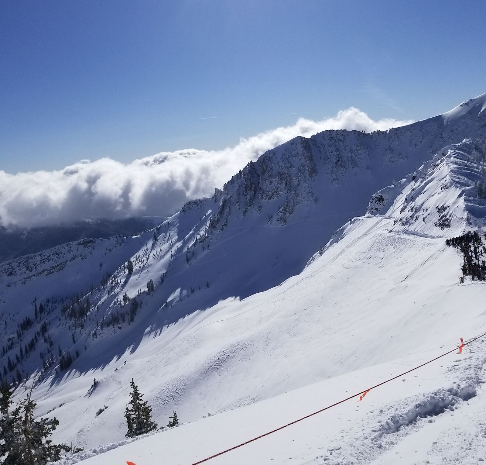

```{r setup, include=FALSE}
knitr::opts_chunk$set(echo = TRUE)
library(readr)
library(dplyr)
```
# Snowbird Chairlifts and Trails

Snowbird is one of the world's top ski mountains, located up Little Cottonwood Canyon from the Salt Lake Basin in Utah, in a spot where impressive amounts of perfectly skiable snow pile up every year.  Here's a look at the trail map for the back and front sides of the mountain:

```{r map1, echo=FALSE, out.width="100%", fig.cap="Back Side of Snowbird"}
knitr::include_graphics("images/snowbird_backside.png")
```
```{r map2, echo=FALSE, out.width="100%", fig.cap="Front Side of Snowbird"}
knitr::include_graphics("images/snowbird_frontside.png")
```


\newpage


There's a lot of information in these standard trail maps, and snow sports enthusiasts could spend all day looking at them.  But even a frequent Snowbird visitor, perhaps relegated to building and querying databases about the mountain he's unable to get to during the pandemic, can tell you that there's much to learn about the layout of the mountain from an abstracted, data-driven look at what you see on the map.  

A few important and common questions that I'll at least provide a structure for answering in this brief analysis are:

* "Based on my abilities, which chairlift should I take?"
* "My group is going to split up for a couple of hours.  Where should we meet up later?"
* "I'm a skier, not a snowboarder.  Is there a part of the mountain I might prefer?"
* "Which lift gives you the most choices of runs to take?"
* "It's my last day here. How can I get as many good runs in as possible before lifts close?"

### Here's where the data to answer these questions come from, and how they're organized:
I used PostgreSQL in pgAdmin 4 to build a database of six normalized tables, which amounts to a "toy example", but which offers a great opportunity to learn about database architecture and also provides a solid scaffolding for a more thorough analysis and representation of the map/topology of the mountain.  The data all come from the publicly available trail map at https://snowbird.com, but knowledge of which ```lifts``` access which ```runs```, and vice versa, isn't always completely obvious from a glance at the map.  That's where I used my domain knowledge in the ```access``` table of the database, which models a many-to-many relationship between chairlifts and the runs they access.  Rather than pointing this out later, when you'll have forgotten this background, the most important next step to this project is to add an analogous table which represents which _runs_ access which _lifts_.  The value there is in making a complete map of how you can get from wherever you are to wherever you want to be, which is a constant struggle on a huge and often unfamiliar mountain.

The relationship between the six tables is diagrammed here:

```{r ERD, echo=FALSE, out.width="100%"}
knitr::include_graphics("images/snowbERD.png")
```

Although I did include most of the lifts, I only included about a quarter of all runs, specifically the ones that my family and our friends have enjoyed on group trips over the years, providing a nice sample range of skill levels and terrain.  The ```people``` table lists just 8 of us so far, along with our favorite chairlift and preferred sport (snowboarding/skiing), and will be very easy to build to a size where it's actually pretty useful as a source of advice for other people.  In case it's not obvious yet, skiers love talking about their favorite anything!

For example, let's take a look at the first question above, "Based on my abilities, which chairlift should I take?" 
```{r liftlevels, message=FALSE}
liftLevels <- data.frame(read_csv("SQL_csvs/lift-run-combos.csv"))
head(liftLevels)
```

The last column, ```level```, contains the info that every skier uses to describe herself, the standard "green", "blue", "black", "double black" scale used in most of the U.S. 
```{r difficulty, message=FALSE}
difficulty <- data.frame(read_csv("SQL_csvs/difficulty.csv"))
head(difficulty)
```

Now if someone said "I like to ski blues mostly", we could look up which lifts serviced such terrain with the highest ratio.  The reason we shouldn't instead just look up which lift accesses the _most_ blues is that lifts that go to the very top of the mountain tend to access the most runs, but they often force a skier to begin with a more difficult run, before leveling out into the blue area.  
```{r}
blues <- liftLevels %>% filter(level == 2)
bluesTable <- table(blues$lift)
liftTable <- table(liftLevels$lift)
bluesTable
liftTable
```

## TODO -- 1) learn R so that I can plot the most basic of concepts, like how to get the proportion of blues for each lift, from the table.  Or how to group_by/aggregate. And how to do the equivalent of a join, but in R.  

#### "My group is going to split up for a couple of hours.  Where should we meet up later?"
A good approach to answering this is to calculate the runs that are reachable from the most lifts:
```{r}
accessibleRuns <- data.frame(read_csv("SQL_csvs/waysToRuns.csv"))
head(accessibleRuns, n=10)
```

#### "I'm a skier, not a snowboarder.  Is there a part of the mountain I might prefer?"
Using the favorite lifts and sport columns of people.csv:
```{r}
people <- data.frame(read_csv("SQL_csvs/people.csv"))
people
```
The skiers in this sample prefer lift 2, which is Peruvian.

#### "Which lift gives you the most choices of runs to take?"\


```{r}
par(mar = c(4, 10, 4, 4))
barplot(sort(table(liftLevels$lift)), horiz = T, las=1, xlab = "runs accessed")
```


#### "It's my last day here. How can I get as many good runs in as possible before lifts close?"

Order the lifts by closing times to see which ones you need to do first:
```{r}
lifts <- data.frame(read_csv("SQL_csvs/lifts.csv"))
lifts
```


```{r, echo=FALSE, out.width="100%", fig.cap="Just Before the Rope Drops at Mineral Basin"}

```
